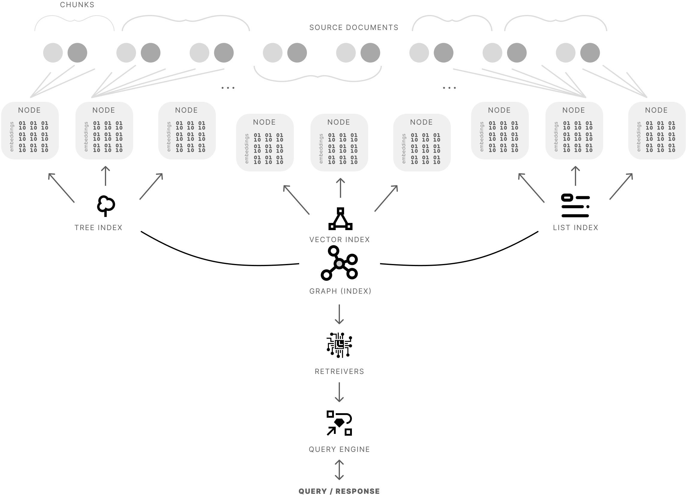
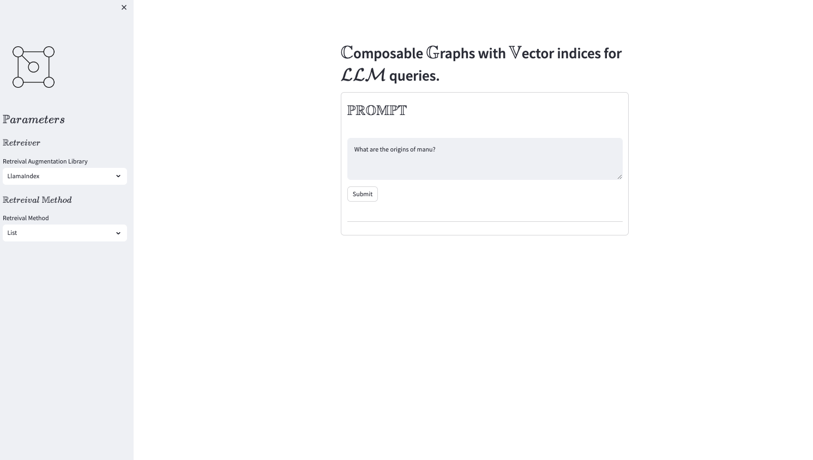
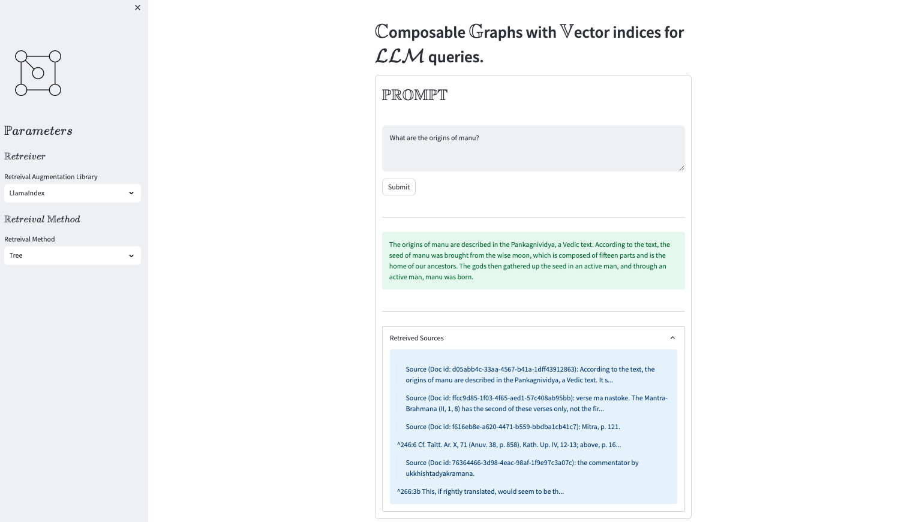

# Composable _graphs_ with MMR queries over _vector_ stores.

$\mathbb{C}$ omposability  allows you to to define lower-level indices for each document, and higher-order indices over a collection of documents. For $e.g.$ imagine defining (1) a tree index for the text within each document, and (2) a list index over each tree index (per document) within your collection.[[1]](https://gpt-index.readthedocs.io/en/latest/how_to/index/composability.html)



Querying the index or a graph involves a three main components:

| Retreivers $\to$                                                        | Response Synthesizer $\to$                                                  | Query Engine                                                                                                                              |
| ----------------------------------------------------------------------- | --------------------------------------------------------------------------- | ----------------------------------------------------------------------------------------------------------------------------------------- |
| A retriever class retrieves a set of Nodes from an index given a query. | This class takes in a set of Nodes and synthesizes an answer given a query. | This class takes in a query and returns a Response object. It can make use of Retrievers and Response Synthesizer modules under the hood. |

For the query logic itself we will use maximum marginal relevance or $\mathcal{MMR}$. In this we iteratively find documents that are dissimilar to previous results. It has been shown to improve performance for LLM retrievals [[2]](https://arxiv.org/pdf/2211.13892.pdf).

The _maximum marginal relevance_ algorithm is as follows: 

$$ \text{{MMR}} = \arg\max_{d_i \in D \setminus R} [ \lambda \cdot \theta_1(d_i, q) - (1 - \lambda) \cdot \max_{d_j \in R} \theta_2(d_i, d_j) ] $$

Here, $D$ is the set of all candidate documents, $R$ is the set of already selected documents, $q$ is the query, $\theta_1$ is the similarity function between a document and the query, and $\theta_2$ is the similarity function between two documents. $d_i$ and $d_j$ are documents in $D$ and $R$ respectively.

The parameter $\lambda$ (mmr_threshold) controls the trade-off between relevance (the first term) and diversity (the second term). If mmr_threshold is close to 1, more emphasis is put on relevance, while a mmr_threshold close to 0 puts more emphasis on diversity.

## How to use

1. Rename `.env.sample` to `.env` and set environment variables `OPENAI_API_KEY`.
   ```sh
   # within main folder
   mv .env.example .env
   echo "OPENAI_API_KEY=<your/key/here>" >> .env
   ```

2. Run App
   ```sh
   streamlit run main.py
   ```

    
    
    

3. Technologies used
   1. openai
   2. llamaindex
   3. langchain
   4. streamlit


## Indices
All example indices can be found in the `storage/` folder for loading/reusing in other projects! They are primarily based on CC-commons Indic literature and history corpus from gutenberg.